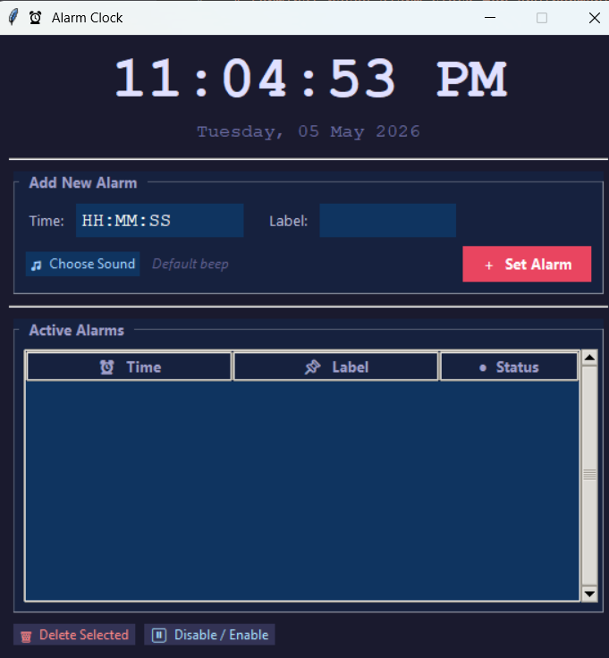

# ⏰ Alarm Clock — Python Project

A modern and feature-rich **Alarm Clock application** built using **Python**, featuring both a **Tkinter GUI** and a **Command-Line Interface (CLI)** version.

---

## 📸 Preview



---

## 🚀 Features

* ⏰ Set multiple alarms
* 🕐 Supports 12-hour & 24-hour formats
* 🔔 Cross-platform sound alerts
* 💤 Snooze functionality (5 minutes)
* 🗑 Delete or enable/disable alarms
* 🎵 Custom alarm tones (GUI)
* 📋 Alarm list display
* 🖥 Real-time clock interface
* 🌙 Midnight auto-reset

---

## 📁 Project Structure

```bash
alarm_clock/
├── alarm_clock.py        # GUI version (Tkinter)
├── alarm_clock_cli.py    # CLI version
├── requirements.txt
└── README.md
```

---

## ⚙️ Installation

### 1️⃣ Requirements

* Python **3.10+**

### 2️⃣ Install Dependencies

```bash
pip install -r requirements.txt
```

> `playsound` is optional — fallback system handles sound automatically.

---

## ▶️ Usage

### 🔹 Run GUI Version (Recommended)

```bash
python alarm_clock.py
```

### 🔹 Run CLI Version

```bash
python alarm_clock_cli.py
```

---

## 🕐 Supported Time Formats

| Input    | Format  |
| -------- | ------- |
| 07:30    | 24-hour |
| 19:30    | 24-hour |
| 7:30 AM  | 12-hour |
| 07:30 PM | 12-hour |

---

## 🔊 Sound Priority System

1. Custom sound file
2. `playsound` library
3. `winsound` (Windows)
4. System beep (`\a`)

---

## 🛠 Tech Stack

* Python
* Tkinter (GUI)
* playsound (Audio)

---

## 🐞 Troubleshooting

| Issue             | Solution             |
| ----------------- | -------------------- |
| tkinter not found | Install `python3-tk` |
| No sound on Linux | Install gstreamer    |
| playsound error   | Use version `1.2.2`  |

---

## 📌 Future Improvements

* Save alarms permanently
* Dark/Light mode toggle
* Desktop notifications
* Mobile-style UI

---

## 👨‍💻 Author

**Rahul Dounde**

---

## ⭐ Support

If you like this project, give it a ⭐ on GitHub!
